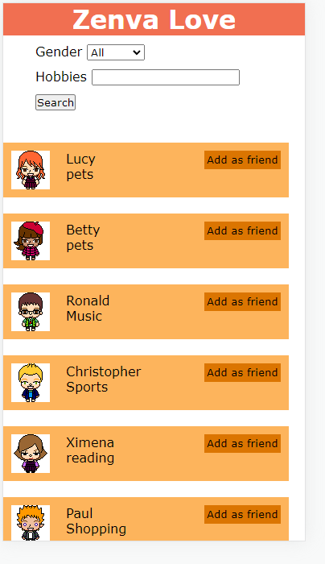

# ZenvaLove
Práctica [Link](https://hydr0bius.github.io/ZenvaLove/).

Es importante tener en cuenta lo siguiente:
* [x] Esqueleto HTML
* [x] CSS
* [x] Seleccionar por id
* [x] Manipular input
* [x] Obtener input
* [x] Combinar todo lo anterior

